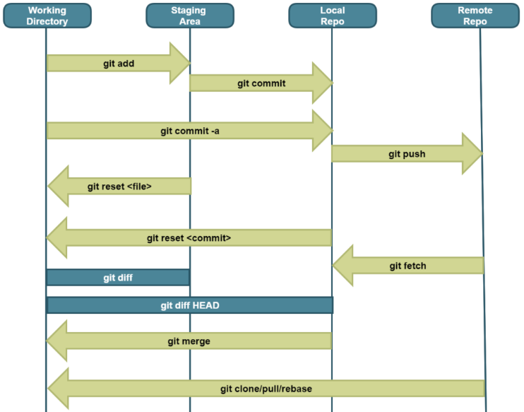
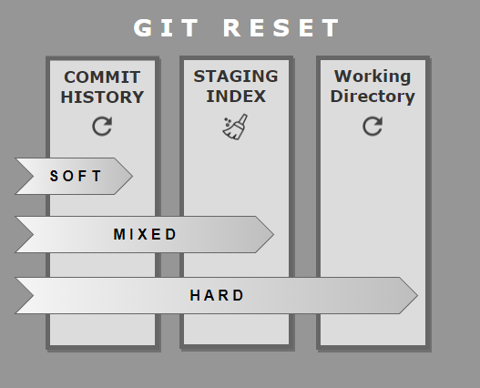

- [Установка/Обновление (Ubuntu)](#установкаобновление-ubuntu)
- [Конфигурация](#конфигурация)
- [Обозначения](#обозначения)
- [Базовая работа с проектом](#базовая-работа-с-проектом)
- [Работа с ветками](#работа-с-ветками)
- [Работа с удаленным репозиторием](#работа-с-удаленным-репозиторием)
- [Информация о коммитах](#информация-о-коммитах)
- [Изменения в коммитах](#изменения-в-коммитах)
  - [Откат проекта/файла к конкретному коммиту](#откат-проектафайла-к-конкретному-коммиту)
  - [Откат проекта к конкретному коммиту с сохранением истории всех коммитов](#откат-проекта-к-конкретному-коммиту-с-сохранением-истории-всех-коммитов)
  - [Откат проекта к конкретному коммиту с сохранением в отдельной ветке](#откат-проекта-к-конкретному-коммиту-с-сохранением-в-отдельной-ветке)
  - [Сокрытие и добавление незакомиченных изменений](#сокрытие-и-добавление-незакомиченных-изменений)
  - [Сжатие коммитов / Объединение](#сжатие-коммитов--объединение)

### Установка/Обновление (Ubuntu) ###

> 1. **sudo add-apt-repository ppa:git-core/ppa**
> 2. **sudo apt-get update**
> 3. **sudo apt-get install git**

**git --version** - версия установленного/обновленного git

### Конфигурация ###

**--system** - etc/gitconfig

**--global** - ~/.gitcinfig

**--local**(default) - project/.git/config

**git config --global user.name "darialissi"** - установить глобально name

**git config --global user.email xx@gmail.com** - установить глобально email

**git config --global core.editor "gedit --wait --new-window"** - настроить текстовый редактор по умолчанию

**git config --unset user.name** - удалить параметр

**git config --list** - посмотреть данные пользователя

**git config --global alias.c "config --global"** - установить алиас "с" для команды "config --global"

**git config --global init.defaultBranch main** - установить имя main для основной ветки (вместо master)

> **.gitignore - файл, где перечислены игнорируемые файлы/директории - тоже нужно коммитить!**

### Обозначения ###
**@** - указатель HEAD

**~** - предыдущий коммит
- **@~** - указатель на родителя HEAD
- **@~2** - указатель на прародителя HEAD

> **[** значения переменных **]**

### Базовая работа с проектом ###

1. **git init** - инициализация проекта
2. **git add [file name]** - добавление в индекс
    - **git add -A** - добавить все файлы
    - **git add .** - добавить все файлы текущей директории
    - **git add ![file name]** - все кроме указанного файла/директории
    - **git add -p [file name]** - добавить файл частично
    - **git status** - отслеживаемые файлы в индексе
    - **git reset [file name]** - удалить файл из add
    - **git reset** - удалить все из add
    - **git restore --staged [file name]** - удалить файл из add
3. **git commit** - добавление комментария через текстовый редактор
    - **git commit -m 'комментарий'** - добавление комментария без текстого редактора
    - **git commit --amend** - изменение последнего коммита
  
4. **git remote add [origin] [git@github.com:USERNAME/REPOSITORY-NAME.git]** - подключение к удаленному репозиторию
    - **git remote** — отобразить алиасы(имена) удаленных репозиториев
    - **git remote rename [origin] [newalias]** - переименование удаленного репозитория
    - **git remote remove [origin]** - удаление репозитория
5. **git push [origin] [branch name]** - публикация на удаленный репозиторий
    - **git push** - последующие публикации

**git diff HEAD** - различия в отслеживаемых файлах рабочей директории и последнего коммита

**git diff** - различие индекса и рабочей директории

**git diff -- [file name]** - различие индекса и рабочей директории в конкретном файле

**git diff --staged** - различие индекса и последнего коммита

**rm -r .git** - удаление локального репозитория

### Работа с ветками ###

**git branch** - локальные ветки

**git branch -a** - локальные и удаленные ветки

**git branch --merged** - основная ветка * и ветки, которые уже слиты в основную (их можно удалять)

**git branch --no-merged** - основная ветка * и ветки, не слитые в основную со своими изменениями

**git branch [branch name]** - создать ветку

**git branch -d <branch name>** - удалить ветку локально

**git push [origin] --delete [branch name]** - удалить ветку на удаленном репозитории

**git push [origin]:[branch name]** — удалить ветку на удаленном репозитории

**git checkout [branch name]** - переключиться на ветку

**git checkout -b [branch name]** - создать и переключиться на новую ветку

**git checkout -b [branch name(произвольное)] [origin/branch name]** - создать локальную ветку на основе ветки слежения

**git branch -u [origin/branch name]** - установить слежение данной ветки к указанной удаленной

**git branch -vv** - показывает различия между ветками слежения и локальными ветками

**git fetch --all; git branch -vv** - сначала получает обновления для веток слежения, потом смотрит различия

**git diff [branch name 1] [branch name 2]** - разница двух веток

### Работа с удаленным репозиторием ###

**git diff [master] [remotes/origin/master]** - пример сравнения **master** ветки локального и удаленного репозитория

1. **git fetch** - загружает изменения с удаленного репозитория, без слияния
2. объединение веток
    - **git merge [branch name]** - соединяет изменения в основной ветке локально (local repository is updateddirectly)
	- **git rebase [branch name 1] [branch name 2]** - перебазирует и переписывает историю коммитов (в отличии от merge, который сохраняет всю хронологию)
      1. **git checkout [branch name]**
      2. **git rebase [master] [branch name]**- перебазирование ветки относительно [master], т.е. перемещение к концу master
  	  3. **git push -f** - принудительно, т.к. история коммитов изменена

**git pull** - *fetch* + *merge* (!!!сразу удаляет изменения локального репозитория при конфликте версий)

**git push [origin] [branch name]** - публикация изменений на удаленный репозиторий

**git clone [git@github.com:USERNAME/REPOSITORY-NAME.git]** - копия удаленного репозитория	

### Информация о коммитах ###

**git reflog** - коммиты с полной историей

**git log** - коммиты для текущей ветки

**git log [branch name]** - коммиты для указанной ветки

**git log --all** - коммиты для всего проекта

**git log --oneline** - коммиты сокращенно

**git log --grep 'issue\d'** - поиск по regex (регистрозависимый), в сообщениях коммитов

**git log --pretty=format:"%h -%an, %ar : %s"**

> **git config --global pretty.my format:"%C(green)%h -%C(blue)%an | %s %C(red)%d"** - алиас "my"
> 
> **git log --pretty=my**

**git log -[n]** - только последних **n** коммитов

**git log -p** - коммиты с diff

**git log --since="date>"**- коммиты после указанной даты

**git log --until="date"** - коммиты до указанной даты

**git log --author=""**

**git log --committer=""**

**git log -S [строка кода]** - выводит коммит в котором была добавлена/удалена указанная строчка кода

**git show [номер коммита]** - инфо о коммите

**git diff [номер коммита 1] [номер коммита 2]** - разница двух коммитов

**git diff [номер коммита 1]:[file name 1] [номер коммита 2]:[file name 2]** - разница конкретных файлов в коммитах

### Изменения в коммитах ###

**git checkout** - отменить все локальные неиндексированные изменения в рабочей директории

**git checkout -- [file name]** - отменить локальные неиндексированные изменения конкретного файла в рабочей директории

**git checkout [номер коммита - HEAD по умолчанию] [file name (необязат)]** - переключиться на конкретный коммит/состояние файла

**git restore --worktree** - отменить изменения в рабочей директории

**git restore --staged** - отменить изменения в индексе

**git restore -WS** - отменить все незакомиченные изменения

#### Откат проекта/файла к конкретному коммиту ####

1. откат к коммиту и удаление изменений из индекса и рабочей директории локально
	- **git checkout -f [номер коммита - HEAD по умолчанию] [file name (необязат)]**
	- **git reset --hard [номер коммита - HEAD по умолчанию] [file name (необязат)]**
2. удаление неотслеживаемых файлов/директорий
   - **git clean -fdxi**
3. публикация на удаленный сервер с потерей новых коммитов
   - **git push -f**

#### Откат проекта к конкретному коммиту с сохранением истории всех коммитов ####

1. откат к коммиту и удаление изменений из индекса и рабочей директории локально
	- **git revert [номер коммита]** - !создает новый коммит со всеми отмененными коммитами
2. публикация на удаленный сервер
   - **git push**

#### Откат проекта к конкретному коммиту с сохранением в отдельной ветке ####

1. создание ветки и переключение для сохранения изменений текущего последнего коммита
    - **git checkout -b [branch name]**
    - **git branch [branch name]** + **git checkout [branch name]**
2. перенос ветки [master] назад к коммиту
	- **git branch -f [master] [номер коммита]**
	- **git checkout -B [master] [номер коммита]**

#### Сокрытие и добавление незакомиченных изменений ####

1. **git stash** - скрыть незакомиченные изменения
2. **git stash pop** - добавить изменения (независимо от ветки)

#### Сжатие коммитов / Объединение ####

1. вариант

    **git rebase -i HEAD~3**

   - откроется файл с коммитами: 1 строка - pick; далее заменяем pick на squash у коммитов, которые хотим объединить
	https://www.devroom.io/2011/07/05/git-squash-your-latests-commits-into-one/

2. вариант
   
	- **git reset --soft HEAD~3**

	- **git commit -m "new commit message"**

3. вариант

	- **git reset --hard HEAD~3**

	- **git merge --squash HEAD@{1}**

	- **git commit**
